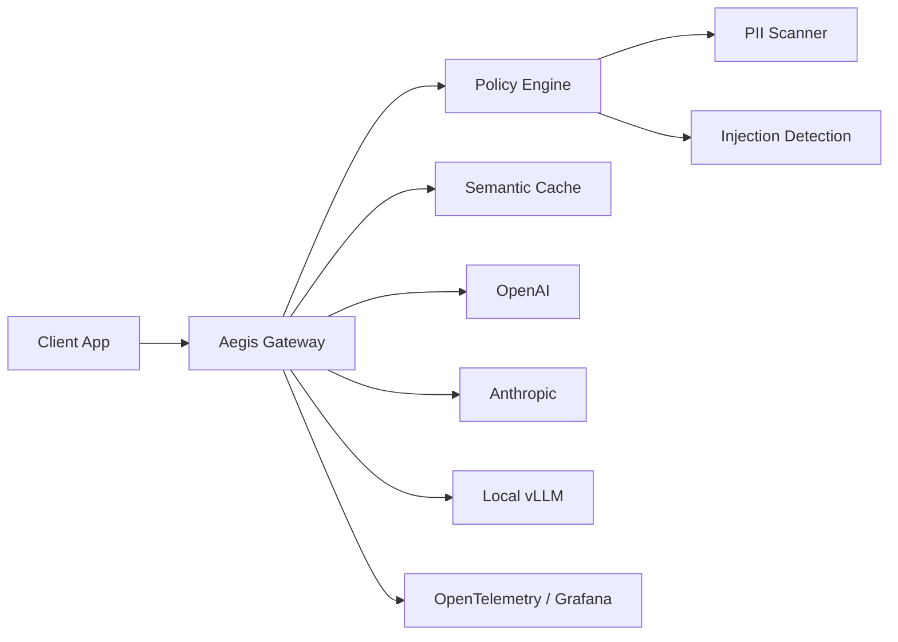

# Aegis (formerly GuardrailX)

[](https://github.com/DARREN-2000/GuardrailX/actions/workflows/ci.yml) [](https://github.com/DARREN-2000/GuardrailX/actions/workflows/deploy-pages.yml) [](https://opensource.org/licenses/MIT) [](https://www.python.org/downloads/) [](https://react.dev)

<p align="center">
  
</p>

Aegis is the deterministic security gateway for non-deterministic AI. We provide real-time policy enforcement, PII redaction, and total observability, enabling enterprises to deploy Large Language Models safely without sacrificing milliseconds.

**The trust layer for enterprise AI.**

## 📖 Project Overview

Enterprises are rushing to deploy AI, but non-deterministic models introduce unprecedented security, compliance, and privacy risks.

Aegis acts as a real-time proxy between your applications and LLM providers, enforcing strict policies, redacting sensitive data, and providing deep observability. We give engineering and security teams the confidence to ship AI products fast, knowing their data is protected and their models are behaving predictably.

### 🌟 Product Vision

Aegis aims to provide the enterprise governance and security infrastructure required to deploy AI safely at scale. We are the definitive policy-as-code runtime for AI workloads.

## ✨ Key Features

- **Real-time PII Masking:** Automatically identify and redact sensitive data (PII, PCI, PHI) before it leaves your network. High-performance regex and NER models running at the edge.
- **Injection Defense:** Block malicious prompts designed to bypass your system instructions. ML-based classification trained on the latest adversarial techniques.
- **OpenTelemetry Native:** Deep visibility into latency, token usage, and policy violations. Plugs directly into Datadog, Grafana, and Prometheus.
- **Version-Controlled Rules:** Define security policies alongside your application code using YAML/JSON. Native CI/CD integration.
- **Universal Proxy:** One API to access OpenAI, Anthropic, Gemini, vLLM, Ollama, and other local models. Standardized request/response formats.
- **Intelligent Quotas:** Prevent runaway costs with user-level and model-level rate limits. Redis-backed sliding window algorithms.
- **Semantic Caching:** Serve similar requests instantly from cache, bypassing the LLM. Vector-based similarity search.
- **Bring Your Own Cloud:** Deploy Aegis inside your own VPC for maximum control. Meet the strictest enterprise security requirements with Helm charts and Terraform.

## 🏗️ Architecture Overview

Aegis is designed for sub-millisecond latency and massive scale.

- **Backend:** FastAPI (Python), PostgreSQL, SQLAlchemy, Alembic, Redis.
- **Frontend:** React 19, TypeScript, Tailwind CSS, shadcn/ui, Framer Motion.
- **Observability:** OpenTelemetry, Prometheus, Grafana.



## ❓ Why This Exists

Generative AI applications are fundamentally vulnerable to prompt injection, data exfiltration, and hallucinations. Traditional WAFs (Web Application Firewalls) cannot inspect natural language payloads effectively. Aegis fills this gap by providing an AI-native proxy that understands the semantics of requests and responses.

## ⚖️ Comparison With Alternatives

| Feature | Aegis | Langfuse | Helicone |
| :--- | :---: | :---: | :---: |
| **Open Source** | ✅ Yes | ✅ Yes | ✅ Yes |
| **Inline Policy Enforcement** | ✅ Yes | ❌ No | ⚠️ Partial |
| **PII Redaction (Edge)** | ✅ Yes | ❌ No | ❌ No |
| **Semantic Caching** | ✅ Yes | ❌ No | ✅ Yes |
| **Bring Your Own Cloud (VPC)** | ✅ Yes | ✅ Yes | ✅ Yes |
| **Latency Focus** | ✅ <2ms overhead | ➖ Async tracking | ➖ Caching focus |

## 📸 Screenshots & Demonstrations

**Dashboard Overview**
The Aegis dashboard provides a comprehensive view of your enterprise AI traffic. The central metrics panel displays real-time token consumption segmented by LLM provider (OpenAI vs. Anthropic), while the live event stream highlights intercepted prompt injection attempts in red, allowing security teams to immediately analyze malicious payloads.

**Policy Configuration**
Aegis allows operators to define security boundaries directly within the UI. The policy editor features a built-in YAML validator. In this demonstration, a developer configures a PII Redaction policy, enabling regular expressions for Social Security Numbers and Credit Cards, and instantly deploys the rule to the edge gateway without a restart.

**CLI Initialization**
For developers preferring the terminal, the `aegis init` command scaffolds a complete local environment. The interactive prompt guides the user through connecting to their local PostgreSQL instance and automatically provisions the required database tables and default tenant configuration in under ten seconds.

## 🛠️ Technology Stack

- **API:** FastAPI, Pydantic, Uvicorn
- **Database:** PostgreSQL (asyncpg), SQLAlchemy 2.0, Alembic
- **Caching & Rate Limiting:** Redis
- **Frontend:** Vite, React 19, TypeScript, Tailwind CSS
- **Observability:** OpenTelemetry

## 📂 Project Structure

```
Aegis/
├── backend/            # FastAPI application
│   ├── app/            # Core business logic and endpoints
│   ├── tests/          # Pytest suite
│   ├── alembic/        # Database migrations
│   └── requirements.txt
├── frontend/           # React 19 application
│   ├── src/            # Components, hooks, pages
│   ├── public/         # Static assets
│   └── package.json
├── docs/               # Extensive documentation
├── policies/           # Default policy templates
└── infrastructure/     # Docker Compose, Kubernetes manifests
```

## 🚀 Installation & Quick Start

### Running Locally with Docker Compose

Bring up Postgres, the backend, and a static frontend build:

```bash
git clone https://github.com/DARREN-2000/GuardrailX.git
cd GuardrailX
cd infrastructure/compose
docker compose up --build
```

- Backend API: `http://localhost:8000`
- Frontend UI: `http://localhost:5173`

### Development Setup

**Backend:**
```bash
cd backend
python -m venv venv
source venv/bin/activate
pip install -r requirements.txt
uvicorn app.main:app --reload --port 8000
```

**Frontend:**
```bash
cd frontend
npm ci --legacy-peer-deps
npm run dev
```

## ⚙️ Configuration & Environment Variables

Key backend variables (see `backend/.env.example`):

- `DATABASE_URL`: PostgreSQL connection string (e.g., `postgresql+asyncpg://user:pass@db:5432/aegis`)
- `ENVIRONMENT`: `development`, `staging`, or `production`
- `OTEL_ENABLED`: Set to `true` to enable tracing
- `REDIS_URL`: Redis connection for caching/rate limits

## 🌍 Production Deployment

For production, we recommend deploying Aegis inside your VPC using our Kubernetes Helm charts or Terraform modules (located in `infrastructure/`).

Ensure you have configured proper database connection pooling (e.g., PgBouncer) and a highly available Redis cluster for rate limiting.

## 💻 Usage Examples

### API Example: Health Check

```bash
curl -X GET http://localhost:8000/api/v1/health/live
```

**Response:**
```json
{
  "status": "ok",
  "service": "GuardrailX",
  "environment": "development"
}
```

### Python SDK Example (Conceptual)

```python
from aegis import AegisClient

client = AegisClient(api_key="your_api_key")
response = client.chat.completions.create(
    model="gpt-4",
    messages=[{"role": "user", "content": "Write a python script"}],
    policies=["no-pii", "block-injections"]
)
print(response.choices[0].message.content)
```

## ⚡ Performance & Benchmarks

Aegis is engineered for critical paths. Our Rust-based proxy components and highly optimized Python async API ensure **<2ms p99 latency overhead** for inline policy evaluation.

## 🔒 Security

- SOC2 Type II compliance (in progress).
- AES-256 encryption at rest for all logs.
- Strict RBAC for dashboard access.
- See our [Security Policy](SECURITY.md) for vulnerability reporting.

## 🚧 Limitations

- Currently supports text-based LLM payloads (multi-modal support planned for v2).
- Semantic caching requires an external vector database connection in high-throughput environments.

## 🗺️ Roadmap

- [ ] V2: Multi-modal (Image/Audio) policy enforcement.
- [ ] Native integration with Databricks Model Serving.
- [ ] Managed Cloud offering (Aegis Cloud).
- [ ] Fine-grained access control (ABAC) for policies.

## 🤝 Contributing

We welcome contributions! Please read our [Contributing Guide](CONTRIBUTING.md) and [Code of Conduct](CODE_OF_CONDUCT.md) before submitting a Pull Request.

## 📄 License

This project is licensed under the MIT License - see the [LICENSE](LICENSE) file for details.

## 🙏 Acknowledgements

Built with ❤️ using FastAPI, React, and OpenTelemetry.

## 💬 Support & FAQ

For enterprise support, please contact `enterprise@aegis.ai`.

**FAQ:**
- **Q: Does this slow down my app?** A: Aegis adds minimal overhead (<2ms).
- **Q: Can I run this offline?** A: Yes, Aegis is completely self-hostable in a VPC.
