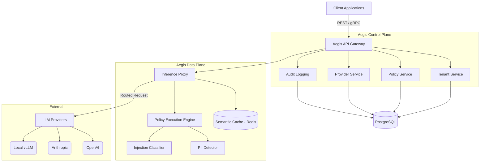
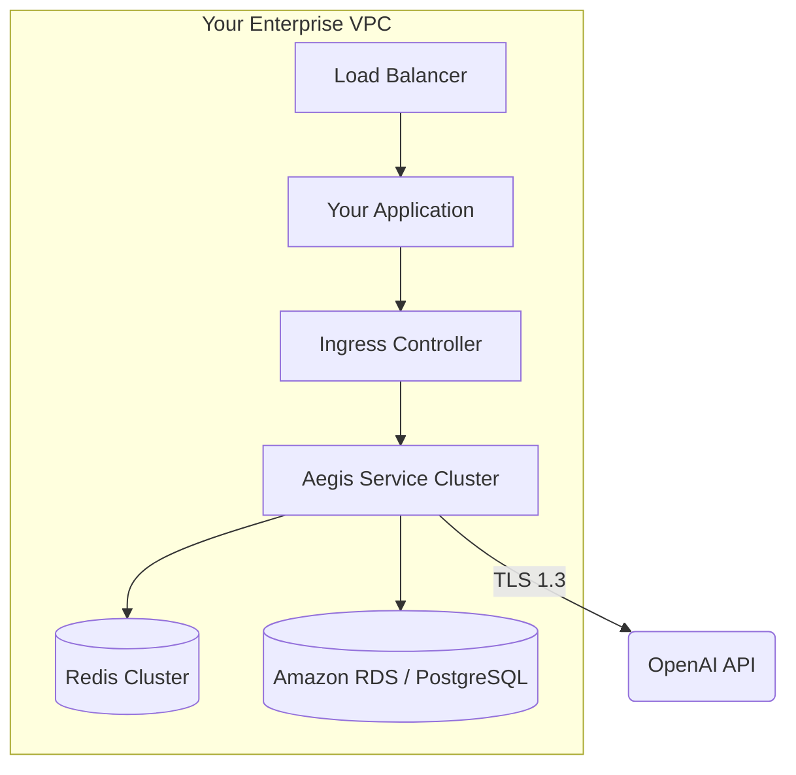
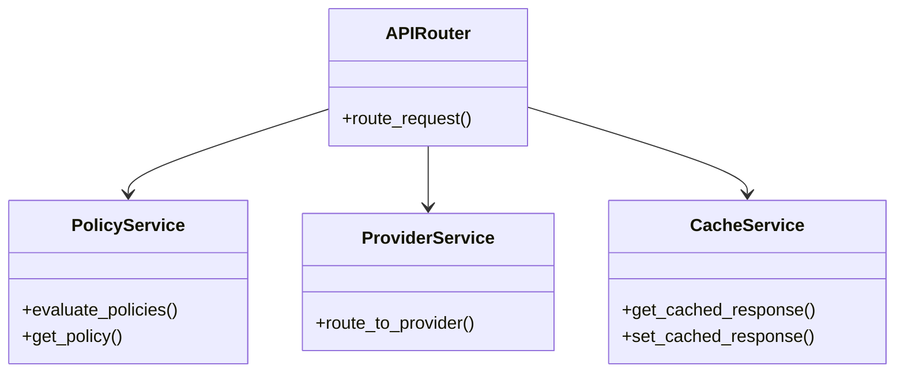

# Architecture Guide

Aegis is engineered for extreme performance, security, and extensibility. It operates as an inline proxy, sitting between your client applications and the upstream LLM providers.

## System Architecture

## Deployment Architecture

Aegis is designed to be deployed entirely within your own Virtual Private Cloud (VPC), ensuring that sensitive data and prompts never leave your controlled network boundary before being redacted or approved.

## Request Lifecycle

1. **Ingress:** A request arrives at the Aegis API Gateway.
2. **Authentication:** The request is authenticated and mapped to a specific Tenant.
3. **Caching (Pre-Execution):** The Semantic Cache is checked. If a highly similar, previously approved prompt exists, the cached response is returned immediately.
4. **Policy Evaluation (Input):** The prompt is routed through the Policy Execution Engine. Policies (e.g., PII Redaction, Prompt Injection Detection) are evaluated in parallel.
5. **Proxying:** If the input policies pass, the (potentially mutated/redacted) request is forwarded to the designated LLM Provider.
6. **Policy Evaluation (Output):** The LLM's response is intercepted and evaluated against output policies (e.g., Toxic Content Filtering, PII Leak Prevention).
7. **Audit Logging:** The entire transaction (original prompt, mutated prompt, provider latency, policy decisions, response) is asynchronously logged to the database.
8. **Egress:** The final response is returned to the client.

## Component Diagram

Aegis utilizes a clean architecture pattern to decouple business logic from infrastructure concerns.

## Infrastructure & Scaling Model

Aegis is stateless at the application layer, allowing for trivial horizontal scaling.

- **Compute:** Scale the FastAPI/Uvicorn workers horizontally via Kubernetes HPA based on CPU or custom request latency metrics.
- **Database:** PostgreSQL handles configuration and audit logging. Use read replicas for heavy read workloads (e.g., dashboard analytics).
- **Cache/Rate Limiting:** Redis handles rate limiting and semantic caching. Use a clustered Redis deployment for high availability.
